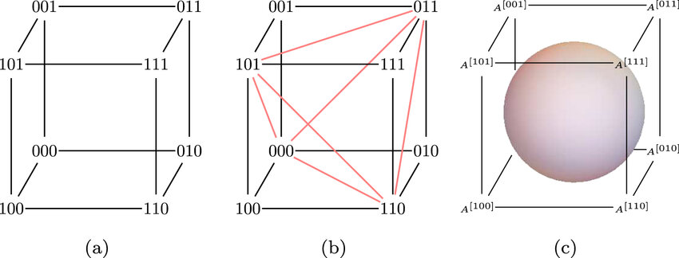

# System-level diagnosis - An Introduction and Recent Results

|    Date    |   Speaker   |                            title                            |                                Note                                 |
| :--------: | :---------: | :---------------------------------------------------------: | :-----------------------------------------------------------------: |
| 2026/09/15 | 王大進 教授 | System-level diagnosis - An Introduction and Recent Results | [Note 1 Images](./images/70d7e2f2-f8c8-456e-af77-b8cc35eadf0e.jfif) |

## Abstract

### Motivation

目標用來辨識複雜且互相連接的系統中的故障元件  
e.g.

- 多處理器網路
- 分散式系統
- 微服務

### Methodology

多個節點(nodes)在一定數量的 t-faulty node 下測試結果是可靠的  
`there is a maximally node allowed number of "t" `  
也就是 _T-diagnosable_  
而 `t` 的大小取決於 graph's dimension  
 `t = Dimension - 1`
這套方法叫做 _PMC Model: Prepare - Metze - Chien_  
從直覺可知 faulty node 不可太多，策略才會奏效

e.g.  
這是一個 2-Dimension 的圖例 而它可以容許的 faulty node 是 1-Diagnosable

  
圖例來源: [Tutorialspoint - Graph & Graph Models(Discrete Mathematics )](https://www.tutorialspoint.com/discrete_mathematics/graph_and_graph_models.htm)

這是一個 3-Dimension 的圖例 而它可以容許的 Faulty node 是 2-Diagnosable  
  
圖例來源: [Figure - available from: Journal of Physics A: Mathematical and Theoretical](https://www.researchgate.net/figure/a-Hamming-cube-for-binary-vectors-of-length-3-b-the-simplex-code-F-2-3_fig1_278047924)

### Conclusion

Question 1: 請問王教授，如何判斷 Graph's Dimension?因為 100 個 Nodes 可以是 2-Dimension 而 8 個 Nodes 可以是 3-Dimension  
A: 透過進制的方式可以得知此圖形維度

Question 2: 那請問如何知道此圖形的進制呢?  
A: 這個在我們得到圖形的時候就會知道是甚麼進制的了

#### My Conclusion:

所以不論是甚麼進制方式，我們從位元數去判斷維度就可以了  
如果是十進制的 4-Dimension 那圖形的每個 Node 會以 `xxxx` 的方式去標註，e.g. `9413`、`1248`
如果是二進制的 3-Dimension 那就會是 `101`、`111`

## Reference

[System-level diagnosis](https://www.researchgate.net/publication/2958611_System-Level_Fault_Diagnosis)
