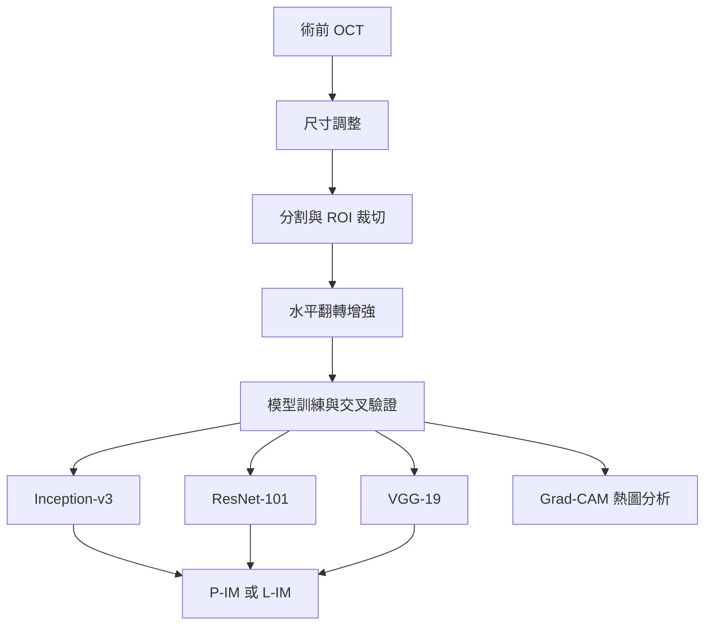

|   Date    |   Speaker   |                                                     title                                                      |
| :-------: | :---------: | :------------------------------------------------------------------------------------------------------------: |
| 2026/9/22 | 彭徐鈞 教授 | Using a Deep Learning Model to Predict Postoperative Visual Outcomes of Idiopathic Epiretinal Membrane Surgery |

# 使用深度學習預測特發性黃斑上膜手術後的視覺預後

## 1. 報告範圍與閱讀方式

本報告整理照片中可辨識的研究背景、資料收集、標籤定義與深度學習流程，並補充資工角度的方法分析。它是講座筆記型 README，不是程式專案的安裝文件，也不是完整論文逐章翻譯。

文中使用三種證據標示：

- **【投影片】**：照片直接呈現的資訊；以照片編號追溯。
- **【方法解析】**：協助理解的解說、計算或批判性分析，不代表研究團隊已執行該項實驗。
- **【論文補充】**：來自同名正式論文的公開摘要，與照片版本分開記錄。

**版本注意事項：照片未包含模型成效表與最終結論；同名正式論文的資料規模也不同。不可將正式論文的結果直接配到照片中的樣本數。** 講者姓名、演講日期與完整投影片版本無法由這 10 張照片確認。

## 2. 研究摘要

【投影片：9913、9916、9917、9920】研究關注的問題是：能否僅使用手術前的光學同調斷層掃描（OCT）影像，預測特發性黃斑上膜病人在手術一年後，最佳矯正視力是否改善至少兩行？

研究動機來自臨床上結構與功能不完全一致的現象：術後黃斑厚度下降，視力卻不一定明顯改善。因此，研究以術前影像作為輸入，比較 Inception-v3、ResNet-101 與 VGG-19 三種模型，執行視力改善程度的二元分類，並透過 Grad-CAM 觀察模型關注的影像區域。

| 項目                 | 照片所示內容                                        |
| -------------------- | --------------------------------------------------- |
| 研究疾病             | 特發性黃斑上膜，Idiopathic epiretinal membrane      |
| 輸入                 | 術前 OCT 影像                                       |
| 預測時間點           | 手術後一年                                          |
| 預測目標             | 最佳矯正視力改善是否達到 Snellen 視力表兩行         |
| 任務類型             | 監督式學習、影像二元分類                            |
| 模型                 | Inception-v3、ResNet-101、VGG-19                    |
| 前處理               | Resize、Segmentation／ROI cropping                  |
| 資料增強             | Horizontal flip                                     |
| 驗證                 | 架構圖標示「5x cross validation」；另有外部測試資料 |
| 解釋工具             | Grad-CAM 熱圖                                       |
| 目前照片能支持的結論 | 已交代研究設計；無法單憑照片判斷哪個模型最佳        |

## 3. 臨床背景與問題定義

### 3.1 黃斑上膜與術後恢復

【投影片：9914】簡報將黃斑上膜（Epiretinal membrane, ERM）介紹為常見的視網膜疾病，並區分特發性與次發性。處置包括保守觀察及手術。

投影片列出一般人口盛行率約 7%–11%，並將術後視力恢復期間標示為 6–12 個月。這些是講者引用的背景資訊；照片沒有提供適用年齡、族群與完整研究出處，因此不宜直接推廣為所有族群的固定比例或每位病人的恢復期限。頁面註記來源為 American Academy of Ophthalmology 的 Basic and Clinical Science Course 2019–2020，Section 12。

### 3.2 為何不能只看厚度改善？

【投影片：9916】簡報提出三個臨床挑戰：

1. 術後黃斑厚度明顯下降，視力仍可能不佳。
2. 單憑 OCT 影像能否預測預後，或必須搭配臨床資料？
3. 如何將 OCT 生物標記與最終視力表現建立有效關聯？

第三點原投影片的英文表述較強烈，本報告將其整理為研究上的整合挑戰，不解讀為「OCT 生物標記完全沒有預測價值」。

【方法解析】厚度屬於影像結構資訊，視力則是功能結果。模型的目標是學習影像與後續功能變化之間的統計關係；即使影像外觀改善，也不能直接等同視力恢復。

### 3.3 為何採用影像單一模態？

【投影片：9916】中文註記指出，臨床資料可能不完整或不夠精確，例如其他潛在疾病、視力下降或視物變形的確切時間。因此研究嘗試單靠術前 OCT 預測，而未將這類臨床資訊納入模型輸入。

【方法解析】這是一項資料可得性與模型設計的取捨，不能據此認定臨床資訊無用。若要證明影像單一模態已足夠，仍應比較「影像模型」「臨床資料模型」與「影像加臨床資料模型」。

## 4. OCT 與關鍵名詞

【投影片：9915】OCT 頁面展示視網膜分層影像，標出內側朝向玻璃體、外側朝向脈絡膜的方向，並提及影像生物標記與術後結果的研究。

| 縮寫／術語 | 英文                         | 中文與本研究中的用途                             |
| ---------- | ---------------------------- | ------------------------------------------------ |
| ERM        | Epiretinal membrane          | 黃斑上膜／視網膜前膜；本研究的疾病對象           |
| OCT        | Optical coherence tomography | 光學同調斷層掃描；模型的影像來源                 |
| BCVA       | Best-corrected visual acuity | 最佳矯正視力；建立結果標籤的依據                 |
| ROI        | Region of interest           | 感興趣區域；影像裁切的目標範圍                   |
| ILM        | Internal limiting membrane   | 內界膜                                           |
| NFL        | Nerve fiber layer            | 神經纖維層                                       |
| GCL        | Ganglion cell layer          | 神經節細胞層                                     |
| IPL        | Inner plexiform layer        | 內叢狀層                                         |
| INL        | Inner nuclear layer          | 內核層                                           |
| OPL        | Outer plexiform layer        | 外叢狀層                                         |
| ONL        | Outer nuclear layer          | 外核層                                           |
| ELM        | External limiting membrane   | 外界膜                                           |
| EZ         | Ellipsoid zone               | 橢圓體帶；照片標示 Ellipsoid Zone                |
| RPE        | Retinal pigment epithelium   | 視網膜色素上皮；圖中與 Bruch's membrane 合併標示 |
| Biomarker  | —                            | 生物標記；用來描述可能與結果相關的影像特徵       |

照片另標示 Myoid Zone、Photoreceptor OS、Vitreous 與 Choroid。這張解剖示意圖能協助定位結構，但不能證明模型實際使用了其中某一層作為判斷依據。

## 5. 研究設計與資料來源

### 5.1 設計與倫理審查

【投影片：9917、9918】研究採回溯性資料，資料來源為臺北市立聯合醫院仁愛院區與忠孝院區，收集期間為 **2015-07-01 至 2022-07-31**。

架構頁列出倫理審查編號 **TCHIRB-11208004-E**，並表示由於研究的回溯性質，獲豁免知情同意。此為投影片所述，不代表所有回溯性研究都可自動豁免。

### 5.2 納入條件

【投影片：9918】

1. 特發性黃斑上膜，且具有術前 OCT 影像。
2. 術後至少一年解剖結構與功能追蹤。

【方法解析】術前影像用來預測；一年後的視力資料用來建立標籤。兩者的時間角色必須分清楚，否則可能把預測當下尚不可取得的資訊誤放進模型。

### 5.3 病例篩選流程

【投影片：9921】依照片流程圖轉錄如下：

| 階段／排除原因                                                             |  人數 |  眼數 |
| -------------------------------------------------------------------------- | ----: | ----: |
| 兩院區最初接受 ERM 手術者                                                  | 1,773 | 1,839 |
| 排除：追蹤流失                                                             |    81 |    81 |
| 排除：影像品質不佳                                                         |    23 |    25 |
| 排除：次發性 ERM、屈光介質混濁，或接受無併發症白內障手術以外的其他眼內手術 |   998 | 1,019 |
| 排除：手術失敗、術後併發症、復發                                           |    18 |    18 |
| 最終納入                                                                   |   653 |   696 |

【方法解析】數字加總可相互核對：

```text
人數：1,773 − 81 − 23 − 998 − 18 = 653
眼數：1,839 − 81 − 25 − 1,019 − 18 = 696
```

排除手術失敗、併發症與復發者，會限制模型適用對象。模型若只在這些篩選後病例上有效，不能直接宣稱它可以預測所有術前病人的整體手術結果。

### 5.4 OCT 儀器、掃描與手術條件

【投影片：9919】

| 項目       | 內容                                          |
| ---------- | --------------------------------------------- |
| OCT 儀器一 | RTVue Model-RT 100，version 3.5；Optovue      |
| OCT 儀器二 | Cirrus 5000-HD-OCT；Carl Zeiss Meditec        |
| 掃描方式   | 以中央凹為中心，標準 10 mm 水平與垂直 B-scan  |
| 手術醫師   | 3 位視網膜專科醫師，具超過 5 年視網膜手術經驗 |
| 手術系統一 | Constellation system；Alcon                   |
| 手術系統二 | Stellaris Elite system；B&L                   |

【方法解析】設備與院區差異可能帶來影像風格差異，因此外部測試不只是更換一批圖片，也可檢查模型是否依賴特定來源的特徵。不過照片沒有完整交代每種設備與院區的對應分布，不能自行推定。

## 6. 分類目標與資料分布

### 6.1 標籤定義

【投影片：9920】以術後一年 BCVA 相對術前的改善行數為基準：

| 類別 | 全名                          | 判斷條件                    |
| ---- | ----------------------------- | --------------------------- |
| P-IM | Pronounced visual improvement | Snellen 視力表改善至少 2 行 |
| L-IM | Limited visual improvement    | Snellen 視力表改善少於 2 行 |

【方法解析】若令 $\Delta L$ 表示改善行數，可將標籤編碼為：

$$
y = \begin{cases}
1, & \Delta L \geq 2 \\
0, & \Delta L < 2
\end{cases}
$$

其中 0、1 是本報告為說明而採用的編碼，照片未提供程式中的實際編碼。

這項任務預測的是**改善程度的類別**，不是精確的最終視力數值，也不是「手術成功／失敗」。L-IM 可能包含小幅改善、無改善或惡化，不能將整組稱為沒有療效。

### 6.2 照片中的資料切分

【投影片：9921】左側流程圖使用 patients／eyes，右側分類統計使用 images；以下保留原本單位。

| 集合       | 院區     | 人數 | 眼數 | 右側標示影像數 | P-IM | L-IM |
| ---------- | -------- | ---: | ---: | -------------: | ---: | ---: |
| 訓練／驗證 | 仁愛院區 |  607 |  644 |            644 |  416 |  228 |
| 外部測試   | 忠孝院區 |   46 |   52 |             52 |   29 |   23 |
| 合計       | 兩院區   |  653 |  696 |            696 |  445 |  251 |

**單位疑點：眼數與右側影像數相同，卻另有水平與垂直掃描的描述。照片不足以確認每眼輸入一張、兩張或合成影像，亦不能確認「images」是否是簡化標示。**

### 6.3 類別比例與基準線

【方法解析：依照片數字計算】

| 集合       | P-IM 比例 | L-IM 比例 | 全部預測多數類別時的 Accuracy |
| ---------- | --------: | --------: | ----------------------------: |
| 訓練／驗證 |    64.60% |    35.40% |                        64.60% |
| 外部測試   |    55.77% |    44.23% |                        55.77% |

訓練／驗證資料有類別不平衡，因此 Accuracy 必須搭配其他指標解讀。以上基準線只是計算結果，並非模型實測表現。

## 7. 深度學習處理流程

### 7.1 一般機器學習流程

【投影片：9912】一般流程依序為取得資料、前處理、推導特徵、訓練模型、迭代選模，以及將訓練好的模型整合進實際系統。

【方法解析】這張是通用流程介紹，不能據此認定本研究已完成臨床部署。對深度學習而言，特徵通常可由網路在訓練過程中共同學習，不一定需要先人工設計一份獨立特徵表。

### 7.2 本研究架構

【投影片：9917】下圖依照片重整；三個模型為比較對象，照片沒有表示它們組成集成模型。



圖中未另畫院區切分，實際重現時應先固定訓練／驗證／測試歸屬，再於訓練資料內進行資料增強。

### 7.3 前處理的用途與未知細節

| 步驟                       | 方法上的用途       | 照片未交代的細節                     |
| -------------------------- | ------------------ | ------------------------------------ |
| Resize                     | 統一模型輸入尺寸   | 寬高、插值方法、是否維持比例         |
| Segmentation／ROI cropping | 聚焦相關影像區域   | 人工或自動、分割工具、邊界與裁切規則 |
| Horizontal flip            | 增加訓練影像變化   | 增強機率、是否僅在訓練 fold 使用     |
| 模型輸入準備               | 讓影像符合網路格式 | 灰階轉換、通道數、強度正規化         |

【方法解析】裁切可能降低背景干擾，也可能移除有用資訊，需由消融實驗判斷。資料增強則不會創造新的獨立病人；不能把增強後張數當成臨床樣本數。

### 7.4 模型比較應如何理解？

【投影片】三個模型名稱已確認；是否採用預訓練權重、凍結哪些層、如何微調，照片均未交代。

【方法解析】公平比較應盡量固定資料切分、前處理、評估方式與調參預算。不能只因某個模型層數較多，就推定效果較佳。若各模型使用不同的輸入規則，也應清楚記錄，避免把前處理效益誤歸因於架構本身。

### 7.5 交叉驗證與外部測試

【投影片：9917】架構圖寫「5x cross validation」。一般可理解為五折交叉驗證，但照片未顯示實作；是否真為五折、是否重複多次、是否分層或按病人分組，仍待確認。

【方法解析】若採五折交叉驗證，會輪流以其中一折驗證、其餘四折訓練。對本資料最重要的不是「有做五折」這個名稱，而是**同一位病人的雙眼、不同切面與增強影像是否維持在同一資料分組**。

外部測試集應在模型、超參數與分類門檻決定後使用。如果反覆根據外部測試表現調整模型，該集合就不再是乾淨的最終測試。

### 7.6 Grad-CAM 的角色與限制

【投影片：9917】研究使用 Grad-CAM 產生熱圖。

【方法解析】熱圖用於檢查模型對分類結果較敏感的區域，可以協助觀察模型是否關注視網膜本身，或受文字、邊框與設備特徵影響。但熱圖不是精確的病灶分割，也不是因果證明；關注區域看起來合理，不等於模型已被證明理解疾病機制。

## 8. 評估指標與結果的正確讀法

### 8.1 建議檢視的指標

【方法解析】以下以 P-IM 為正類建立解說，不主張原始程式必定採相同編碼。

| 指標                | 公式／意義                | 本題中的解讀                               |
| ------------------- | ------------------------- | ------------------------------------------ |
| Accuracy            | $(TP+TN)/(TP+TN+FP+FN)$   | 全部預測中答對的比例                       |
| Recall／Sensitivity | $TP/(TP+FN)$              | 真正明顯改善者有多少被辨識出來             |
| Specificity         | $TN/(TN+FP)$              | 真正改善有限者有多少被辨識出來             |
| Precision           | $TP/(TP+FP)$              | 被預測明顯改善者中，實際符合的比例         |
| F1-score            | $2TP/(2TP+FP+FN)$         | Precision 與 Recall 的綜合指標             |
| AUROC               | 不同門檻下的 ROC 曲線面積 | 模型區分兩類的能力，不等於單一門檻的準確率 |

TP 為正確預測 P-IM，TN 為正確預測 L-IM，FP 為將 L-IM 預測為 P-IM，FN 則相反。

### 8.2 照片能否回答哪個模型最好？

不能。這 10 張照片沒有 Accuracy、AUROC、混淆矩陣或模型排名。由照片可以描述研究設計，但不能自行補上「達到 90%」「ResNet 最佳」等實驗結論。

### 8.3 同名正式論文補充：與照片分開閱讀

【論文補充：參考資料 W1、W2】同名文章刊於 _American Journal of Ophthalmology_，2025 年第 272 卷，67–78 頁；DOI：10.1016/j.ajo.2025.01.003。作者為 Hsin-Le Lin、Po-Chen Tseng、Min-Huei Hsu、Syu-Jyun Peng。

公開摘要列出內部資料為 **1,392 張 OCT／696 眼**，外部測試為 **152 張／76 眼**。摘要報告 ResNet-101 整體表現最佳：Recall 0.90、Specificity 0.90、Precision 0.91、F1 0.90、Accuracy 0.90、AUROC 0.97。

| 項目           | 照片版本                    | 正式論文公開摘要     |
| -------------- | --------------------------- | -------------------- |
| 內部訓練／驗證 | 644 眼；右側標示 644 images | 696 眼、1,392 張 OCT |
| 外部測試       | 52 眼；右側標示 52 images   | 76 眼、152 張 OCT    |
| 模型成效       | 未提供                      | 列出 ResNet-101 成效 |

**差異原因未確認。** 可能涉及版本更新、納入樣本或影像計數方式，但目前無法判定。論文結果不可拿來替照片中的 52 眼測試集推算答對幾眼，也不可將其當成完全重建講座結果的證據。

## 9. 研究優點、限制與批判性分析

以下為方法評讀，不是講者已承認的缺點，也不是指控研究確實犯下相關錯誤。

### 9.1 設計上的優點

- **問題具體**：將術後一年視力改善轉為明確可檢驗的目標。
- **輸入與預測時間有區分**：術前影像預測術後結果，符合預後研究的基本時間方向。
- **設有院區外部測試**：相較只在同一來源內隨機切分，更有助於檢查來源轉移後的表現。
- **比較多種架構**：可以檢查模型選擇是否影響結果，而非只報告單一網路。
- **搭配熱圖分析**：可提供檢查錯誤關注區域的線索。

### 9.2 最需確認的風險

| 問題                     | 為何重要                         | 應補充的證據                       |
| ------------------------ | -------------------------------- | ---------------------------------- |
| 病人層級資料洩漏         | 同人雙眼或多切面可能高度相關     | 以 patient ID 分組的切分規則       |
| 病人、眼與影像單位混用   | 會影響樣本量、指標分母與不確定性 | 每眼影像數、預測聚合與評估單位     |
| 術前視力對改善標籤的影響 | 起始視力較好者可能較難再改善兩行 | 依術前 BCVA 分層的結果與基準模型   |
| 排除失敗與併發症         | 評估族群可能比真實術前族群單純   | 納排標準理由與更廣泛病例驗證       |
| 類別不平衡               | Accuracy 可能掩蓋少數類別錯誤    | 混淆矩陣、Recall、Specificity、F1  |
| 外部集較小               | 少量錯誤即可使比例明顯變動       | 信賴區間與病人層級統計方法         |
| 設備／院區效應           | 模型可能利用來源特徵             | 分設備與分院區分析                 |
| ROI 處理的可重現性       | 人工操作可能影響結果及部署成本   | 分割規則、操作者一致性、自動化測試 |
| 缺乏臨床資料比較         | 無法證明影像單一模態已足夠       | 影像、臨床、多模態的公平比較       |
| 預測機率未校準           | 分類排序好不代表機率可信         | 校準曲線、Brier score 等分析       |

照片外部集右側列為 52 張；若以每張為一個評估單位，每多錯一張，Accuracy 約變動 $1/52 \approx 1.92$ 個百分點。這只是敏感度示例；實際評估若以眼或病人為單位，應使用相應分母，並考慮同人雙眼的相關性。

### 9.3 預後預測不等於手術效益的因果估計

【方法解析】研究觀察的是接受手術者的後續結果。它沒有直接回答「同一個人接受手術，相較不接受手術，能多改善多少」。因此，即使模型預測準確，也不能只憑輸出決定病人應不應手術。

同樣地，改善少於兩行不代表病人沒有其他受益；本研究標籤沒有涵蓋所有功能、症狀與生活品質面向。

## 10. 適合課堂或研討會提出的問題

| 優先度 | 問題                                                                           | 檢查重點         |
| ------ | ------------------------------------------------------------------------------ | ---------------- |
| 高     | 資料切分是否以病人為單位？同一病人的雙眼與水平、垂直切面會不會分到不同 fold？  | 資料洩漏         |
| 高     | 流程圖的 eyes 與右側 images 數量相同，每眼實際輸入幾張？如何得到眼層級的預測？ | 資料與評估單位   |
| 高     | 以改善兩行為標籤時，如何處理術前視力較好、改善空間較小的病人？                 | 標籤與基準視力   |
| 高     | 為什麼排除手術失敗、併發症與復發？這是否限制模型在術前使用的範圍？             | 選擇偏差與適用性 |
| 中     | ROI 是人工還是自動產生？不同操作者裁切會影響模型預測嗎？                       | 可重現性         |
| 中     | 有沒有比較 OCT 單獨輸入與加入臨床資訊的模型？                                  | 模態選擇         |
| 中     | 外部測試結果是否附信賴區間？模型與門檻是否在外部測試前固定？                   | 統計與測試獨立性 |
| 中     | Grad-CAM 關注區域如何由醫師驗證？錯誤案例是否也有分析？                        | 解釋可靠性       |
| 補充   | 簡報與正式論文的資料量不同，是版本更新還是計數單位差異？                       | 版本釐清         |

若只能問一題，建議優先確認病人層級切分與多切面歸屬，因為這直接影響模型表現是否可信。

## 11. 從資工角度可學到的重點

1. **先把問題轉成可驗證的任務。** 明確定義輸入、預測時間點與標籤，比先挑模型更重要。
2. **資料切分是研究設計的一部分。** 醫療影像不是每張都彼此獨立；分組錯誤會讓測試成效失真。
3. **特徵學習不會消除標籤問題。** 即使網路可以自動學習，改善兩行這個標準仍會影響模型回答的問題。
4. **比較模型要控制條件。** 前處理、資料版本與調參方式不同，可能比架構名稱更影響結果。
5. **可視化解釋需要驗證。** 熱圖可用於找線索與錯誤，不應直接視為醫學機制證明。
6. **報告中的單位不可混用。** 病人數、眼數、原始影像數與增強後影像數應分開列出。
7. **外部測試仍有適用範圍。** 另一院區的成功驗證，不自動等同所有醫院、設備與族群都有效。

## 12. 若要重現研究，還缺哪些資料？

| 分類       | 待取得項目                                                         |
| ---------- | ------------------------------------------------------------------ |
| 原始資料   | 匿名病人 ID、眼別、影像、術前與術後一年 BCVA、院區與設備欄位       |
| 標籤       | 視力行數計算規則、追蹤時間允許範圍、缺失資料處理                   |
| 影像單位   | 每眼切面數、影像選取規則、多影像結果聚合方式                       |
| 前處理     | 輸入尺寸、強度處理、ROI／分割方法、增強參數                        |
| 模型       | 預訓練來源、分類頭、凍結層、微調策略                               |
| 訓練       | Loss、optimizer、learning rate、batch size、epochs、early stopping |
| 驗證       | 固定分組清單、隨機種子、交叉驗證定義、模型與門檻選擇方法           |
| 評估       | 評估單位、混淆矩陣、各 fold 結果、外部集結果、信賴區間             |
| 可重現環境 | 程式、套件版本、硬體條件、模型權重                                 |

上述項目在照片中不完整，因此本 README 不虛構訓練指令、套件需求或可執行程式。

## 13. 結論

這項研究把具體的臨床疑問轉化為影像二元分類任務：使用術前 OCT，預測特發性黃斑上膜病人在術後一年是否達到至少兩行的視力改善。照片交代了回溯性資料來源、病例篩選、三種模型、前處理、交叉驗證與 Grad-CAM 分析，但沒有提供模型成效。

研究評讀的關鍵是資料分組、影像與眼的計數方式、改善標籤的限制，以及外部測試的獨立性。同名正式論文有公開結果，但資料版本與照片不同，應分開引用。現有資料足以建立完整的方法理解，尚不足以單靠這批照片重現研究或評估全部臨床效益。

## 14. 來源(簡報)

| 頁面主題                                    | 本報告對應內容                        |
| ------------------------------------------- | ------------------------------------- |
| Machine learning workflow                   | 通用機器學習流程                      |
| 研究題目                                    | 主題與任務                            |
| Epiretinal membrane                         | 疾病背景與恢復                        |
| Epiretinal membrane OCT                     | OCT 分層與術語                        |
| Challenges Encountered in Clinical Practice | 研究動機與影像單一模態                |
| Research Framework                          | IRB、前處理、模型、交叉驗證、Grad-CAM |
| Data Collection                             | 院區、期間、納入條件                  |
| Data Collection                             | 儀器、掃描、醫師與手術系統            |
| Data Collection                             | P-IM／L-IM 定義                       |
| Data Collection                             | 篩選流程、資料切分、類別數量          |

### 14.2 正式論文核對來源

- **W1｜PubMed 論文摘要與書目**：[PMID 39814096](https://pubmed.ncbi.nlm.nih.gov/39814096/)
- **W2｜期刊出版頁**：[American Journal of Ophthalmology](https://www.sciencedirect.com/science/article/pii/S0002939425000224)
- **DOI**：[10.1016/j.ajo.2025.01.003](https://doi.org/10.1016/j.ajo.2025.01.003)

外部資料核對日期：2026-09-22。正式論文部分以公開摘要為限，未假稱已檢視完整全文與補充資料。表格中無來源標記的風險分析、問題與重現清單，屬本報告的研究方法評讀。
